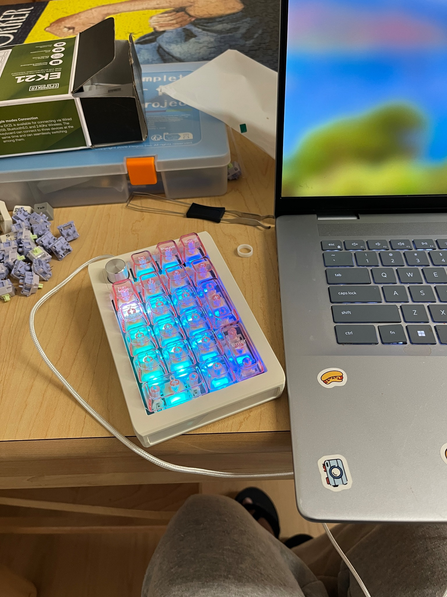
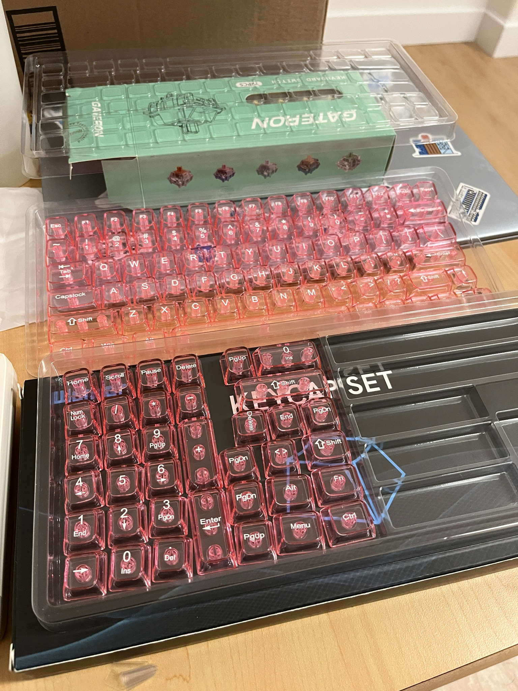
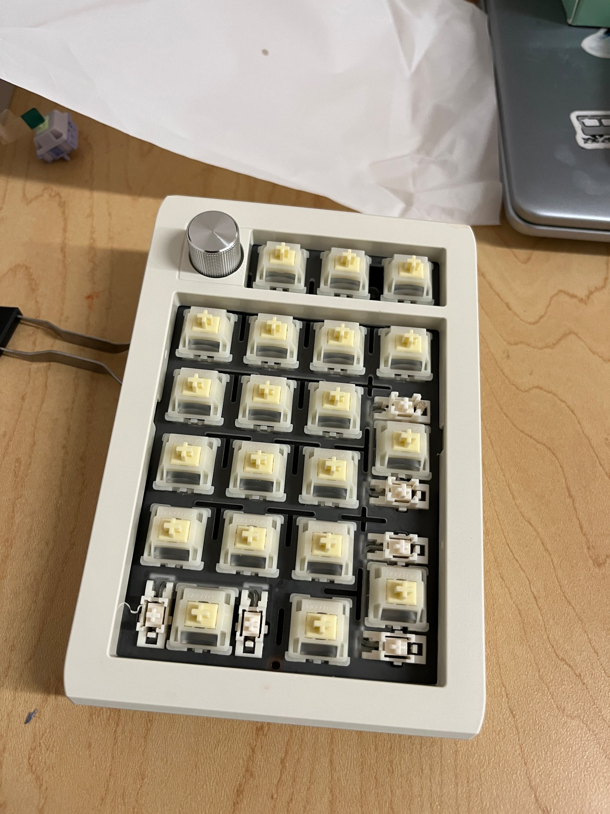
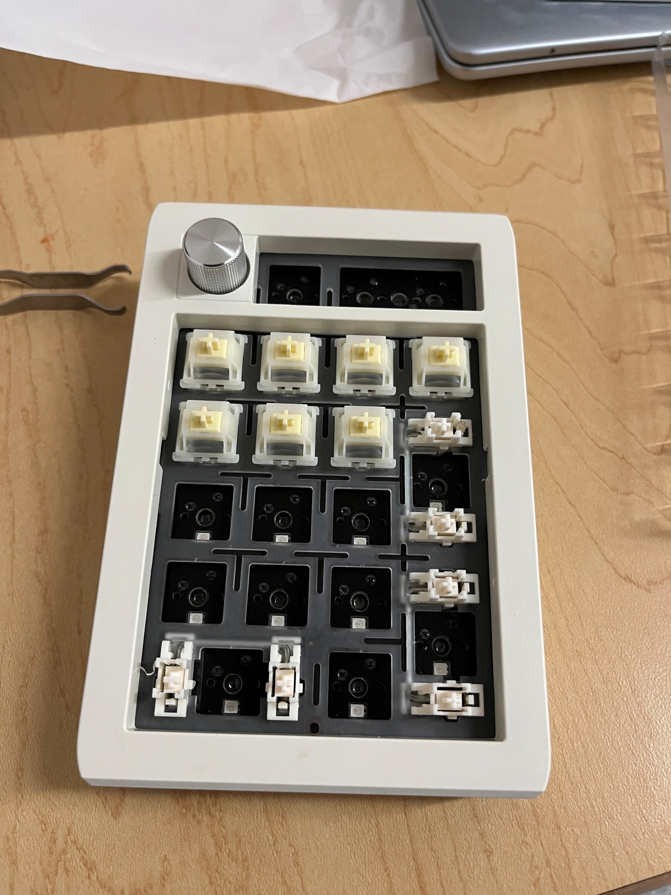
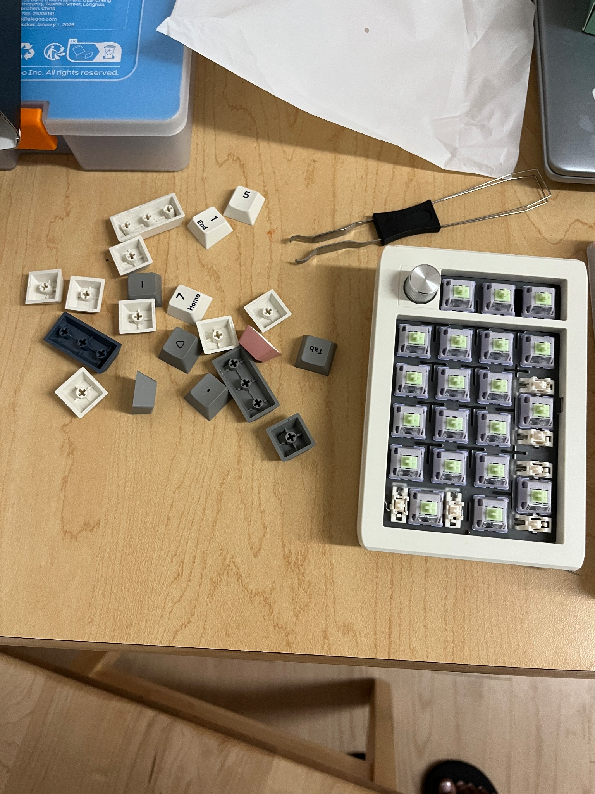
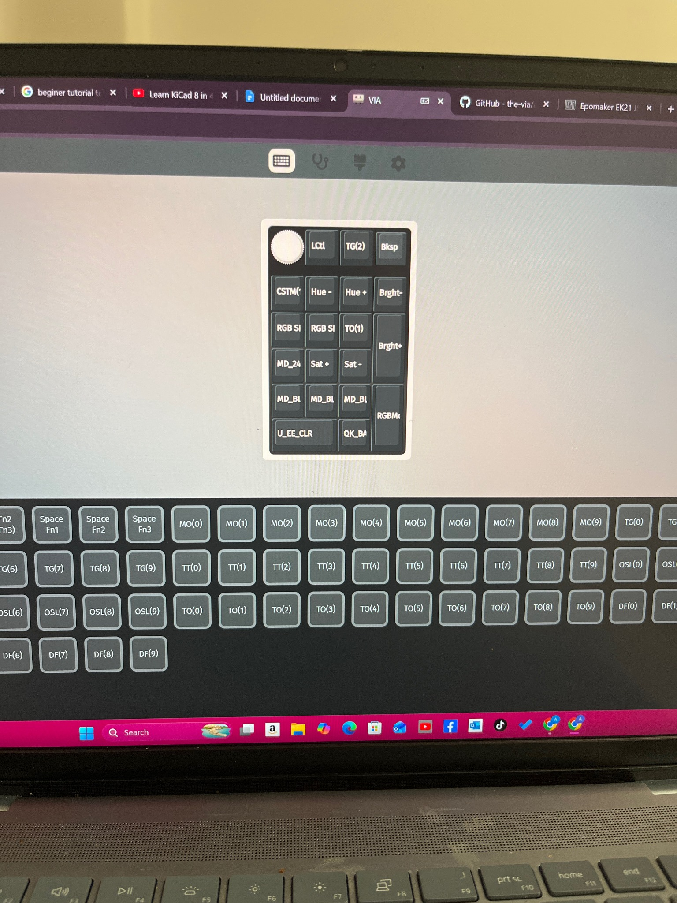
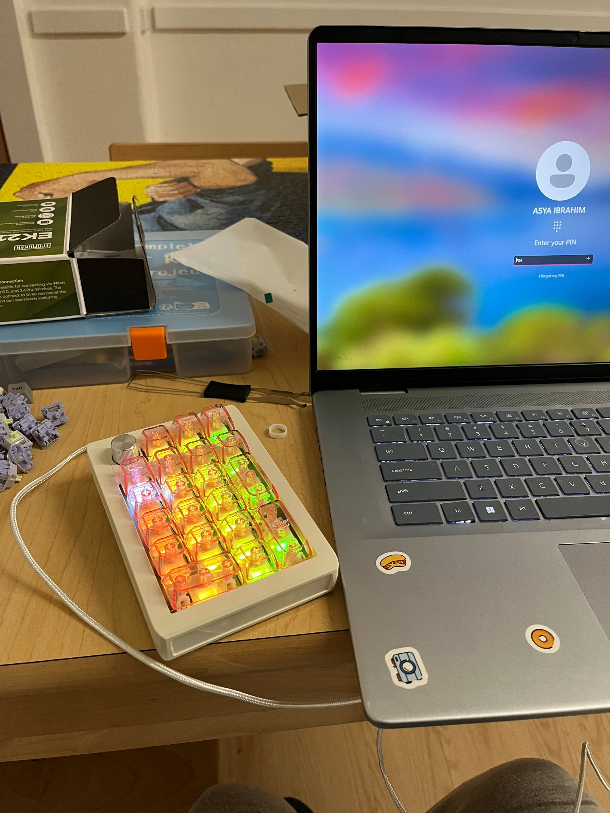
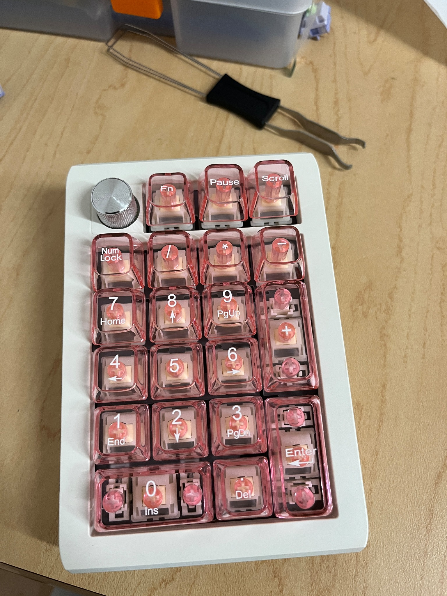

# 🎀 Programmable Multi-Layer Engineering Controller ⚡

> A customized programmable numpad built around the way I actually work.

  

## ✨ What is this?

This project started with an **EPOMAKER EK21 VIA Numpad** and the idea that a small keyboard could become more than a number pad.

I customized the physical board and used **VIA** to create multiple layers for different engineering workflows:

- 🔢 **Base layer** — everyday navigation and number-pad functions
- 💻 **Programming layer** — shortcuts and controls for coding workflows
- 🔧 **KiCad layer** — shortcuts designed around circuit and PCB-design work

The same physical keys can take on different functions depending on the active layer.

---

## 🛠️ Hardware

- **EPOMAKER EK21 VIA Numpad**
- Mechanical switches
- Translucent pink keycaps
- USB cable
- Keycap puller / assembly tools

  

---

## 🔧 Build Journey

### 01 — Taking it apart

The first step was getting comfortable with the physical hardware and removing the original keycaps.

  

### 02 — Understanding the board

With the keycaps removed, the switches and board became much easier to inspect and work with.

  

### 03 — Installing the new keycaps

I installed the translucent pink keycaps and worked through the small physical assembly issues that came up along the way.

  

---

## 💻 Designing the Interfaces

The physical customization was only half of the project.

Using **VIA**, I experimented with layers and key assignments so the same hardware could support different workflows.

  

The goal was not simply to add shortcuts, but to create interfaces that made the tools I was learning easier to access.

This meant learning how layer switching works, figuring out how to return to the base layer, and remembering which keys perform which functions in each interface.

---

## 💡 RGB Lighting as Functional Feedback

The RGB lighting became more than an aesthetic choice.

Different lighting states help provide a **visual cue for which interface/layer is active**, making it easier to know what the keys currently do.

  

  

So yes, the pink aesthetic was intentional 🎀 — but the lighting also has a practical purpose.

---

## 🧠 What I Learned

This project taught me that engineering projects are often about the interaction between **hardware, software, and the person using the system**.

I learned how to:

- Work with a programmable hardware interface
- Configure multiple keyboard layers using VIA
- Think about shortcuts as workflow design
- Troubleshoot physical assembly issues
- Use visual feedback to make an interface easier to understand
- Connect a physical device to the software tools I am learning
- Iterate when the first setup is not quite right

Most importantly, I learned that customization can change how you interact with technical tools.

---

## 🚀 What I'd Explore Next

If I continue developing this project, I would like to explore:

- More specialized layers for different engineering workflows
- More deliberate visual feedback for layer states
- Better documentation of the key mappings
- Deeper integration with programming and electronics workflows
- Eventually exploring what it would take to build a more custom hardware/software controller from the ground up

---

## 📸 Final Build

  

---

### ♡ Final thought

I started with a numpad.

Somehow it turned into a tiny engineering interface.

Still learning. Still experimenting. Still very much in my EE era. ⚡🎀
